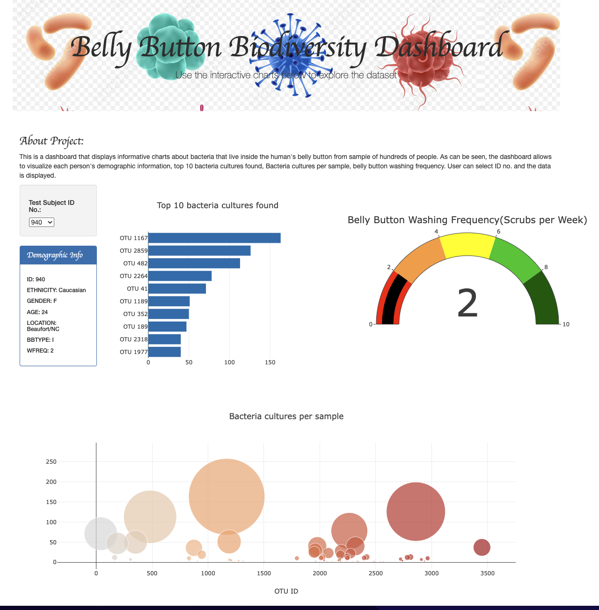

# Belly Button Biodiversity

## Overview of Project

We have created a dashboard that displays informative charts about bacteria that live inside the human's belly button
from sample of hundreds of people. In this project, the dashboard allows to visualize each person's demographic
information, top 10 bacteria cultures found, Bacteria cultures per sample, belly button washing frequency. User
can select ID no. and the data is displayed for that particular ID.

## Deployed Link

https://17keerti.github.io/belly_button_biodiversity/

## Results

